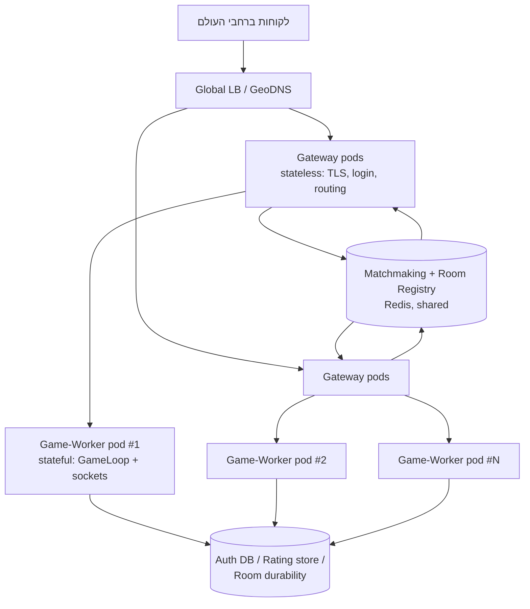

# Server Design — הופכות את KFChess לשרת שסקיילבילי

השבוע האחרון של ה-CTD: מעבר מ"שרת שעובד" ל-Design של שרת שיודע לספוג עומס עולמי.
המסמך הזה בנוי סביב ארבע הדרישות שקיבלנו, כשכל תשובה מעוגנת במה שיש כבר היום
בקוד של הפרויקט (לא תיאורטי בלבד) — כדי שיהיה ברור מה בדיוק צריך להשתנות ולמה.

## המצב הקיים היום — ולמה הוא לא סקיילבילי כמו שהוא

היום `server/ws_server.py`'s `GameServer` הוא **תהליך יחיד**: `asyncio` event loop אחד
שמחזיק את כל חיבורי ה-WebSocket (`server/connections.py`), ו-`server/game_loop.py`'s
`GameLoop` הוא **לולאת tick יחידה** (`run_forever`) שמקדמת את *כל* המשחקים הפעילים,
ברצף, פעם ב-50ms (`DEFAULT_TICK_INTERVAL_S = 0.05`, כלומר 20Hz).

שלוש נקודות תורפה קונקרטיות שמצאתי בקוד, שרלוונטיות ישירות לדרישות למטה:

1. **DB**: `server/accounts_db.py` פותח *חיבור SQLite יחיד*, משותף בין `UserStore`
   ל-`RatingStore`, מוגן ב-`threading.RLock`. זה עובד מצוין לתהליך אחד — אבל
   ה-lock הזה לא עוזר כלום ברגע שיש כמה תהליכים/מכונות, כי SQLite הוא embedded
   DB של קובץ בודד על דיסק אחד, לא DB עם client-server protocol שאפשר להתחבר
   אליו מכמה containers במקביל.
2. **Matchmaking**: `server/matchmaking.py`'s `find_match` הוא סריקה **O(n²)** על
   dict בזיכרון של תהליך אחד. זה יעבוד מצוין לתור מקומי קטן — אבל לא קיים שום
   מנגנון ששני שחקנים שנחתו על שני containers שונים בכלל *יראו* אחד את השני בתור.
3. **Broadcast**: `_advance_game` ב-`server/game_loop.py` שולח בכל tick (20 פעם
   בשנייה!) snapshot **מלא** של הלוח (`full_broadcast_payload` — כל הכלים, ה-move
   log, הניקוד) לשני השחקנים ולכל הצופים — **גם אם שום דבר לא זז**. זה הגיוני
   למשחק real-time עם כלים שנעים ברצף (זו כל הנקודה של KFChess), אבל זו התעבורה
   הדומיננטית בפועל, לא "מהלך כל 2 שניות" — ראו סעיף 3.

המסקנה הכללית: הארכיטקטורה הלוגית (הפרדה בין `GameServer`/חיבורים,
`GameLoop`/state, `CommandRouter`/החלטות, ו-DB stores) כבר **נכונה ומוכנה
להתפצל** לשירותים נפרדים — היא רק רצה כרגע כולה בתוך תהליך אחד.

---

## שאלה 1: מסד נתונים ל-100 מיליון משתמשים רשומים — SQLite יתאים?

**לא.** והסיבה היא לא נפח האחסון (זה דווקא לא הבעיה):

- שורת `accounts` אחת (`username`, `password_hash` — 32 בייט, `password_salt` —
  16 בייט, `rating`) שוקלת בערך 100-150 בייט. גם 100 מיליון שורות זה רק
  **~10-15GB** — קטן בהחלט לדיסק בודד. **אחסון גולמי אף פעם לא הבעיה של SQLite
  בקנה מידה הזה.**
- הבעיה האמיתית: SQLite הוא **embedded DB** — קובץ יחיד על דיסק של מכונה אחת,
  עם חיבור אחד (או חיבורים מרובים לאותו תהליך, לכל היותר). בדיוק כמו
  ש-`accounts_db.py` בונה ידנית `AccountsDatabase` עם lock משותף לתהליך —
  ברגע שיש 200 containers של שרת משחק שכולם צריכים login/rating בו-זמנית,
  אין דרך "להתחבר מרשת" ל-SQLite בלי shared network filesystem (לא אמין,
  ולא נתמך רשמית לכתיבה מקבילה). אין replication מובנה, אין failover, אין
  write scaling אופקי — single point of failure אחד לכל 100 מיליון המשתמשים.

**מה כן** — ומיפוי טבעי לחלוקה שכבר קיימת בקוד בין `UserStore` (auth) ל-
`RatingStore` (rating), למרות ששתיהן היום חולקות את אותה טבלה:

| Store | תדירות כתיבה | דרישת עקביות | הצעה |
|---|---|---|---|
| **Accounts / Auth** | נמוכה (register/login בלבד) | חזקה — שם משתמש לא יכול "להתנגש" | Postgres/MySQL מנוהל, עם read replicas לאימות; שיתוף ב-hash של username אם צריך |
| **Rating / Leaderboard** | גבוהה מאוד (כל סיום משחק = 2 עדכונים) | ניתן eventual consistency | DB מבוזר בסגנון key-value/wide-column (Cassandra/DynamoDB/ScyllaDB) או Postgres מפוצל (sharded), עם cache ב-Redis לקריאות חמות |

אפשר גם Distributed SQL (CockroachDB / Vitess / Spanner) אם רוצים לשמור על
סמנטיקת SQL רגילה אבל עם write scaling אופקי מובנה — פחות שינוי מנטלי לצוות
שכבר כתב SQL ידני כמו ב-`accounts_db.py`.

*הערה מצחיקה אבל רלוונטית: K3s עצמו (ראו סעיף Docker/K8s למטה) ברירת המחדל
שלו לאחסון מצב הקלאסטר היא... SQLite, ועובר ל-etcd/DB חיצוני רק כשצריך
multi-node HA. אותו שיעור בדיוק, בשכבה אחרת.*

---

## שאלה 2: 10 מיליון משתמשים בו-זמנית — כמה שרתים, ואיך כולם משחקים עם כולם

**שרת אחד ממש לא מספיק** — לא רק בגלל עומס CPU/זיכרון, אלא כי `GameLoop.run_forever`
הוא לולאה **חד-תהליכית**: גם אם היינו זורקים על המכונה הזו 128 ליבות, ה-event loop
היחיד הזה לא ינצל יותר מליבה אחת. חייבים ריבוי תהליכים/containers בכל מקרה.

הצעה לחלוקת תפקידים ל-4 שכבות, שממפה כמעט 1:1 לחלוקה הפנימית שכבר קיימת בקוד
(`GameServer` / `GameLoop` / `CommandRouter` / ה-stores):



1. **Gateway (stateless)** — TLS, login מול Auth DB, ומקבל את ה-`LoginMessage`/
   `PlayMessage`/`JoinRoomMessage` הראשוניים (מקביל למה ש-`GameServer._handle_message`
   עושה היום). Scale-out טריוויאלי — כל instance זהה, מאחורי load balancer רגיל.
2. **Matchmaking + Room Registry (משותף לכולם)** — לא עוד `MatchmakingQueue`
   בזיכרון של תהליך אחד, אלא **חנות משותפת** (Redis sorted-set לפי rating,
   O(log n) לחיפוש קרבה) שכל ה-gateways כותבים וקוראים ממנה. **זו התשובה
   ל"איך כולם משחקים עם כולם"**: שחקן מ-ת"א ושחקן מברזיל שנחתו על gateways
   שונים לגמרי — שניהם כותבים לאותו תור משותף, ולכן יכולים להיות matched.
   באותה חנות משותפת (Redis key: `room_id -> worker_id`) גם רשומה **איפה כל
   room חי בפועל** — בדיוק מה שעונה על "איך יודעים איזה שחקנים על איזה שרת":
   כל gateway שמקבל `JoinRoomMessage` עבור room_id X פשוט מחפש בטבלה הזו מי
   ה-worker שמחזיק אותו, ומפנה/מנתב את החיבור לשם.
3. **Game-Worker (stateful)** — כאן חי בפועל מה ש-`server/game_loop.py` עושה
   היום: `GameLoop` אחד לכל pod, עם WebSocket-ים חיים ו-state בזיכרון של
   כמה אלפי משחקים קצרים במקביל. **replicated אופקית**, אבל בניגוד ל-Gateway,
   pod ספציפי **לא פונגיבל** ברגע שמשחק כבר רץ עליו — חיבור צריך sticky
   routing לאותו worker למשך כל חיי המשחק (ראו גם סעיף 4).
4. **Persistence** — Auth DB / Rating store (סעיף 1) + room-durability store
   (המקביל המבוזר ל-`RoomStore` של היום, כדי ש-room ישרוד restart של worker).

זה גם המקום ש-**region sharding** משתלם: כיוון שה-cadence הוא real-time
(תזוזת כלים רציפה, לא רק "מהלך אחד ב-2 שניות" — ראו סעיף 3), latency קריטי.
עדיף cluster אזורי (US/EU/APAC) עם matchmaking שמעדיף בני אותו אזור, ו-fallback
בין-אזורי רק כשאין ברירה — global load balancer/GeoDNS מפנה לקוח ל-region
הקרוב לו קודם כל.

---

## שאלה 3: תעבורת רשת — הרבה או קצת?

### החישוב לפי ההנחיה (מהלך כל 2 שניות)

`MoveMessage` בפועל (`protocol/game_messages.py`) הוא JSON קומפקטי בסגנון:

```json
{"color":"W","source":{"row":6,"col":0},"destination":{"row":5,"col":0},"type":"move"}
```

כ-90 בייט. עם overhead של WebSocket framing (חיבור כבר פתוח, אין TCP handshake
חדש לכל הודעה) — נעגל ל-**~100 בייט/הודעה**.

- 10,000,000 משתמשים × מהלך אחד ל-2 שניות = **5,000,000 מהלכים/שנייה**, גלובלית.
- 5,000,000 × 100 בייט = 500MB/s ≈ **4 Gbps** — *סה"כ, גלובלית, לכל הקלט הנכנס*.

זה **מעט**, ביחס לקנה מידה אינטרנטי — NIC בודד של מכונת cloud מודרנית נותן
10-100Gbps; ברור שבפועל זה מתפזר על פני מאות/אלפי instances (אם יש 1000
gateways, זה ~4Mbps לכל אחד עבור קלט תנועה בלבד — שולי לגמרי).

### אבל — התעבורה האמיתית והדומיננטית היא לא זו

זו הנקודה הכי חשובה שמצאתי בקריאת הקוד: **KFChess הוא לא צ'אט-מהלכים** — הוא
משחק real-time עם כלים שנעים ברצף. `server/game_loop.py`'s `_advance_game`
משדר `full_broadcast_payload` (הלוח **המלא**, כל 32 הכלים + move log + score)
**בכל tick, 20 פעם בשנייה, גם בלי מהלך חדש** — כדי שהאנימציה תהיה חלקה. זה
פי ~40 יותר תדיר מ"מהלך כל 2 שניות".

חישוב גס לגודל snapshot (32 כלים × ~150 בייט/כלי JSON + panel data) ≈ **~6KB**:

- לחיבור בודד: 20Hz × 6KB = **120KB/s**.
- למשחק (2 שחקנים, בלי צופים): **240KB/s**.
- 10M משתמשים ⇒ ~5M משחקים במקביל: 5,000,000 × 240KB/s ≈ **1.2TB/s ≈ ~9.6Tbps**
  אאוטבאונד, גלובלית.

**זה כן הרבה** — ופי ~2 סדרי גודל מהחישוב לפי ה"מהלך כל 2 שניות". זו בעצם
המסקנה המרכזית של הסעיף הזה: **צוואר הבקבוק האמיתי הוא fan-out של שידור מלא
ותדיר, לא קצב הקלט של המשתמש**. כדי שהמערכת תהיה סקיילבילית, לא מספיק "עוד
שרתים" — צריך לצמצם את התעבורה עצמה:

- לשדר **דלתא** (מה השתנה מה-tick הקודם) ולא state מלא בכל פעם.
- קידוד בינארי (protobuf/flatbuffers) במקום JSON טקסטואלי, פלוס דחיסה
  (permessage-deflate).
- להפריד את קצב הסימולציה (20Hz, פנימי לשרת) מקצב השידור ללקוח (למשל 10Hz),
  והלקוח עושה interpolation בין עדכונים — טכניקה סטנדרטית ב-netcode של
  משחקי real-time (Quake/Overwatch style), ולא סתירה ל"תנועה חלקה".

---

## שאלה 4: משחק שנמשך 30-90 שניות — מה זה אומר על תפקידי ה-Docker

לפי Little's Law: 10M משתמשים / 2 לכל משחק = **5M משחקים במקביל**; משך ממוצע
60 שניות (אמצע 30-90) ⇒ קצב תחלופה במצב יציב:

$$\lambda = L / W = 5{,}000{,}000 / 60s ≈ \textbf{83{,}000 משחקים חדשים (וגם מסתיימים) בכל שנייה, ברצף}$$

זה לא burst חד-פעמי — זה קצב **מתמשך**. שתי מסקנות ישירות לעיצוב ה-containers:

1. **לא container אחד למשחק.** משך חיים של 30-90 שניות קצר מדי ביחס לעלות
   scheduling+cold-start של container/pod (גם כמה מאות ms-שניות בודדות
   יכולים להיות אחוז ניכר מחיי המשחק), ובקצב של 83K/שנייה זה גם יחנוק כל
   orchestrator. במקום זה — בדיוק כמו היום: **pod ארוך-חיים אחד מריץ
   `GameLoop` יחיד שמחזיק אלפי משחקים קצרים במקביל**, וה-scaling הוא ברמת
   ה-pod (כמה pods כאלה יש בסך הכל), לא 1:1 מול כל משחק בודד.
2. **matchmaking/room-registry חייבים להיות זולים ומהירים**, לא רק "עובדים" —
   בקצב תחלופה כזה, ה-O(n²) scan של `MatchmakingQueue.find_match` היום פשוט
   לא שורד; זו עוד סיבה לחנות משותפת מסודרת (Redis sorted-set, סעיף 2), אולי
   מחולקת ל-buckets לפי rating/region כדי לשמור כל תור קטן.

תכונה **נחמדה** שנובעת מאותה עובדה: משחק קצר הופך **drain בזמן scale-down/
deploy לזול** — pod שיוצא לפנסיה פשוט מפסיק לקבל משחקים חדשים וממתין ≤90
שניות שהקיימים יסתיימו, בלי live-migration מסובך (בניגוד לשירות עם שיחות
וידאו שיכולות להימשך שעות).

וזו גם הבחנה מעשית בין תפקידי ה-Docker: **Gateway/Matchmaking הם stateless**
— אפשר לאזן עומס בינם חופשי, בלי sticky routing, כי כל בקשה עצמאית. אבל
**Game-Worker הוא stateful** — ברגע שחיבור שובץ ל-worker מסוים, הוא **חייב**
sticky routing לאותו worker לכל אורך ה-30-90 שניות (סוקטים חיים + state
בזיכרון, בדיוק כמו `ActiveGame` ב-`GameLoop` היום) — לא ניתן לאזן-עומס אותו
per-message כמו Gateway רגיל.

---

## Docker / Kubernetes / K3s — מה למדתי ואיך זה מתחבר להצעה

- **Docker** = יחידת packaging + בידוד. כל אחת מ-4 השכבות למעלה (Gateway,
  Matchmaking, Game-Worker, ואולי גם ה-DB-adjacent services) הופכת ל-image
  נפרד — בדיוק כמו ש-`server/` כבר מופרד היום מ-`client/`.
- **Kubernetes** = orchestrator: מתזמן containers על פני הרבה מכונות, service
  discovery (DNS פנימי), autoscaling לפי מדדים (HPA — קריטי כאן, כי העומס
  משתנה כל הזמן עם 83K משחקים/שנייה), rolling deploys, ו-self-healing (pod
  שקרס עולה מחדש לבד). ה-Service הרגיל של k8s (round-robin/least-conn) טוב
  ל-Gateway ה-stateless — אבל **לא** מתאים ל-routing ל-Game-Worker ספציפי
  שכבר מחזיק משחק (שם צריך את חנות ה-routing המפורשת מסעיף 2, לא Service רגיל).
- **K3s** = distribution קליל של Kubernetes (binary בודד, Rancher) — טוב ל-edge/
  clusters קטנים/dev מקומי. מעניין: ברירת המחדל שלו ל-datastore של הקלאסטר
  עצמו היא **SQLite** (!), ועוברים ל-etcd/Postgres חיצוני רק כש-HA/multi-node
  אמיתי נדרש — בדיוק אותה מסקנה כמו בשאלה 1, בשכבה אחרת לגמרי.

---

## שאלות פתוחות שהייתי בודקת בהמשך

- כמה חיבורי WebSocket בפועל סופג pod יחיד (תלוי hardware/tuning) — קובע כמה
  worker pods צריך ל-10M concurrent.
- מודל consistency מדויק ל-matchmaking בין-אזורי (מה קורה כששני שחקנים
  קרובים ב-rating אבל בקצוות שונים של העולם — ל-match בכל מחיר, או להעדיף
  latency?).
- עלות/latency של relay מלא (Gateway מעביר כל הודעה ל-Worker) מול redirect
  ישיר (הלקוח מתחבר ישירות ל-Worker אחרי handshake ראשוני) — trade-off בין
  פשטות תשתית לבין hop נוסף על כל הודעה.
