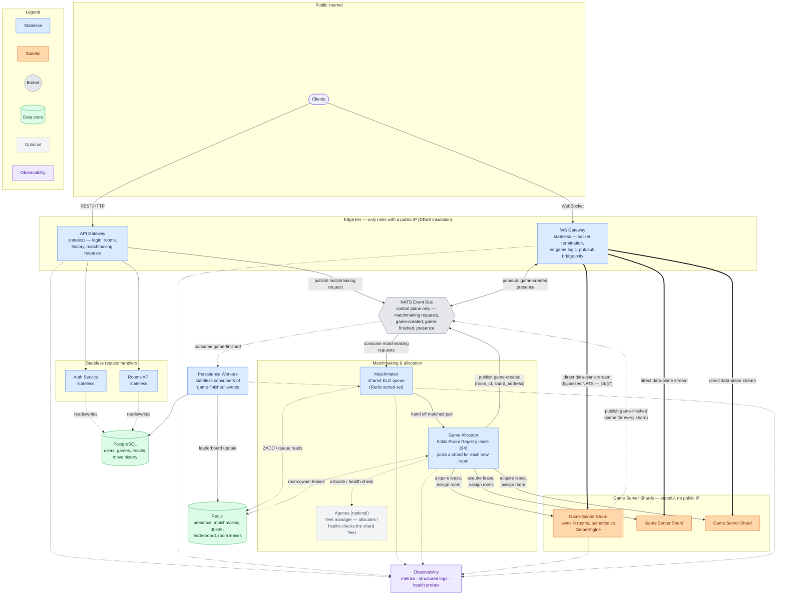

# Server Design — Scaling KFChess for Real-Time Play at Global Scale

**In short**: `server/main.py` on one process works for hundreds of users,
not 100M registered accounts or 10M concurrent players (§1). This document
adopts the course-proposed architecture — API Gateway/WS Gateway,
Matchmaker, Game Allocator, Game Server Shards, NATS, PostgreSQL, Redis,
Docker/Kubernetes, Observability (§2–§4) — then uses it to answer the
assignment's four scaling questions with numbers grounded in this codebase
(§5–§8), plus failure recovery, observability, and capacity sanity-checks
(§9–§12).

**Contents**

- §0 The model the current server already follows
- §1 Why one process is not enough
- §2 Docker / Kubernetes / K3s — the scaling substrate
- §3 Architecture overview
- §4 Room ownership: the gap every registry-only design has
- §5 Question 1 — a database for 100 million registered users
- §6 Question 2 — 10 million concurrent players: distribution and routing
- §7 Question 3 — network traffic: what "a move every 2 seconds" costs
- §8 Question 4 — 30–90 second games: what that means for container roles
- §9 What happens when a server falls, and Observability
- §10 Does the capacity actually add up?
- §11 Role summary
- §12 Open questions

## 0. The model the current server already follows

Before designing for scale, it's worth naming the pattern the existing code
already implements, because the scaled system is an extension of it, not a
replacement: `events/bus.py`'s `Bus` plus `server/publisher.py`'s
`NetworkPublisher` already form a local **publish/subscribe** system — a
`GameSession` publishes domain events (a move started, a piece arrived, a
capture happened) onto its own bus, and `server/game_loop.py`'s
`_broadcast_to_game` fans each event out to every subscriber of that game
(both seats, every spectator username in `ActiveGame.spectator_usernames`).

That's exactly the shape a distributed system needs: **a publisher that
doesn't know who's listening, and subscribers that don't know where the
publisher lives.** The entire scaling design below is this same pattern,
stretched across process and machine boundaries — not a foreign concept
bolted onto the project.

## 1. Why one process is not enough

```
Clients → Game Server (single process) → SQLite
```

This is exactly what `server/main.py` runs today, and it works — for
hundreds of users. It cannot reach 100M registered accounts or 10M
concurrent players, for three concrete reasons found directly in the code:

1. **`server/accounts_db.py`** opens one SQLite connection, guarded by a
   single `threading.RLock`. That lock helps within one process; it does
   nothing once there are hundreds of Docker containers on different
   machines, because SQLite is an embedded, single-file database with no
   client-server protocol for concurrent network access.
2. **`server/matchmaking.py`'s `find_match`** is an O(n²) scan over an
   in-memory `dict`. It works for one process's local queue; it has no way
   to match two players who happened to land on two different servers.
3. **`server/game_loop.py`'s `_advance_game`** broadcasts a *full* board
   snapshot every tick — 20Hz (`DEFAULT_TICK_INTERVAL_S = 0.05`) —
   regardless of whether anything moved. That is the dominant cost in the
   traffic analysis below, and it is the single most important thing this
   design has to change, not just distribute.

## 2. Docker / Kubernetes / K3s — the scaling substrate

**Docker** gives every role (gateway, matchmaking, game-authority,
persistence) one consistent, identical deployment unit:

```
Image → Docker 1, Docker 2, Docker 3, ... Docker N
```

Every copy behaves identically regardless of host machine — this is what
makes horizontal scaling meaningful: instead of building one bigger server,
you run more copies of the same small one. This also matches Python's own
constraints: `GameLoop.run_forever` is a single-threaded, GIL-bound,
sequential tick loop (`for game_id, game in self._games.items()`) — a
Python process doesn't get faster by giving it more cores, only by running
more of it. **Replicate the process, don't enlarge it.**

**Kubernetes / K3s** run many instances of each image, handle service
discovery and load balancing, and drive autoscaling from live metrics
(CPU, memory, connection count, active-room count):

```
100 pods @ 95% CPU → HPA scales up → 150 pods
150 pods @ 10% CPU → HPA scales down → 40 pods
```

K3s is the same model in a single, lightweight binary — good for
edge/dev-scale clusters; production at this size needs full Kubernetes with
an HA control plane (multi-master etcd), so the orchestrator itself isn't a
single point of failure.

**Docker Compose** answers a smaller, different question than either of
the above — not "can this run 10,000 replicas" but "can this run at all,
on one machine, for local development and demos": a single
`docker-compose.yml` bringing up one instance of every role (API Gateway,
WS Gateway, Matchmaker, Game Allocator, one Game Server Shard, Postgres,
Redis, NATS) from the same images the K8s/K3s manifests deploy, with none
of the HPA/multi-node machinery.

**The practical split**: stateless roles (Gateways, Auth Service, Rooms
API, Matchmaker, Persistence-writer) are a plain `Deployment` +
`HorizontalPodAutoscaler`. The role holding live simulation state in
memory (Game-Authority / Game Server Shard) is stateful and needs an
explicit **ownership** mechanism — see §4, where it's a Redis lease
managed by Game Allocator. **Agones** is worth naming as the drop-in
alternative for a from-scratch build: its `Fleet`/`GameServerSet`/
`GameServerAllocation` CRDs give exactly this stateful-fleet-with-a-ready-
buffer semantics natively on Kubernetes, instead of hand-rolling it in
Redis.

## 3. Architecture overview

One invariant holds across every version of this diagram, past and
present, and is worth stating explicitly since it was a specific review
point: **neither the client nor any Gateway ever decides game rules.**
The `GameEngine` inside whichever shard owns a room is the single source
of truth for every state transition; Gateways only relay bytes, and the
client only renders and interpolates what the shard has already decided.

The diagram below adopts the component names and shape from the
course-review diagram directly — **API Gateway** / **WS Gateway** /
**Matchmaker** / **Game Allocator** / **Game Server Shards** /
**Observability**, **NATS** as the internal event bus, **Agones** as an
optional fleet manager — mapped 1:1 onto the roles this document already
argued for. (Earlier sections still say **Game-Authority**; it's the same
stateful role the diagram below calls a **Game Server Shard**, backed by
the same `GameLoop` code discussed in §1.) One refinement from the
original draft survives the alignment, kept for an arithmetic reason
stated in §7 rather than dropped just to match the sketch exactly —
called out where it appears below.



*(Dashed arrows into Observability are drawn only for the six roles §9
names explicitly — API Gateway, WS Gateway, Matchmaker, Game Allocator,
Game Server Shards, Persistence Workers. Every one of them exports the
same three things — metrics, structured logs, health probes — to the same
collector; see the Observability subsection under §9.)*

**Two different transports, deliberately** — the one place this design
refines the course sketch:

- **Control plane** (low volume: matchmaking requests, room creation,
  game-finished, presence changes) — **NATS** (or Redis Pub/Sub, the
  course brief's other named option), matching the pub/sub model in §0.
  Low enough volume that broker overhead is a non-issue, and the
  decoupling is valuable (an API Gateway publishing a matchmaking request
  doesn't need to know which shard will end up hosting it).
- **Data plane** (high volume: the live gameplay stream, up to 20Hz per
  active room) — a **direct** stream from WS Gateway to the specific Game
  Server Shard that owns the room, resolved once via Game
  Allocator/the Room Registry, **not** routed through NATS on every tick.
  §7 shows why: at this scale, a full-state broadcast through a shared
  hop reaches Tbps-range traffic, which would make the broker itself the
  bottleneck. A registry *lookup* is cheap; a broker *relay* of the full
  data volume is not.

This also gives the **DDoS-insulation** property worth keeping from one of
the earlier proposals: Game Server Shards carry no public IP at all —
every external packet terminates at a Gateway (API or WS) first.

Those two Gateways are also the only processes that need to speak TLS at
all — `tls_config.py`'s `get_server_ssl_context` (wired into both
`services/api_gateway/main.py` and `services/ws_gateway/main.py` via
`SSL_CERT_FILE`/`SSL_KEY_FILE`) terminates it right there, matching a real
rollout's likely choice of an Ingress/L4 LoadBalancer doing the same job
at the cluster edge instead (see `k8s/60-api-gateway.yaml`'s own comment).
Either way, every hop behind that edge — Gateway→Shard, Gateway→NATS/Redis,
service→Postgres — stays inside the private compose/cluster network the
DDoS-insulation argument above already relies on, so there's no second TLS
hop to terminate deeper in the system.

## 4. Room ownership: the gap every registry-only design has

A `room_id → worker` mapping (Redis) — maintained by the **Game
Allocator** introduced in §3 — is necessary but **not sufficient**.
Pub/Sub guarantees fan-out (one publish reaches every subscriber); it does
not by itself guarantee that only *one* worker ever believes it owns a given
room's write authority. Without an explicit ownership mechanism, a
rebalance or a flaky failover could produce two Game-Authority pods both
accepting moves for `room_450` — and now there are two disagreeing
versions of the same game.

The fix: room assignment is a **lease**, not just a registry entry —
`SET room:450:owner worker-B NX PX 5000`, renewed by heartbeat while the
worker holds the room, released (or simply expires) on shutdown/crash. A
new worker can only take over once the lease has actually expired, never by
just overwriting a live entry. This is what makes the failure story in §9
sound: Kubernetes restarting a crashed pod is necessary but not sufficient
— the *lease expiry* is what actually authorizes a new owner.

## 5. Question 1 — a database for 100 million registered users

**SQLite doesn't fit.** Not primarily because of data volume (a 100M-row
users table — even at a generous ~1KB/row — is only ~100GB, trivially
absorbed by a normal RDBMS). The real reasons:

- **Single writer**: SQLite allows one write transaction at a time, even in
  WAL mode. Rating updates alone, multiplied by ~83,000 games finishing per
  second (§8), would immediately serialize into a bottleneck.
- **Embedded, not client-server**: it's a single file on one machine's
  disk. Every process that needs it — Gateway, Auth, Matchmaking,
  Game-Authority, all replicated across hundreds of machines — would need
  direct filesystem access to that one file. There is no network protocol
  to share it the way Postgres or MySQL are designed to be shared.
- **No replication, no sharding, no HA** — one crash takes the whole
  dataset down.

**Polyglot persistence, split by write pattern**:

| Data | Store | Why |
|---|---|---|
| Accounts / auth / ELO / games / results / move history | PostgreSQL/MySQL, primary + read replicas | Needs real ACID (unique username, atomic rating update). 100M rows fits one cluster; shard by `user_id` (Citus/Vitess, or CockroachDB/YugabyteDB) once write throughput — not storage — becomes the limit. Matches the course-proposed diagram directly — one relational store for all durable game/user data. |
| Presence / session directory | Redis | Low latency, doesn't need durability beyond a TTL; naturally lives alongside the room-ownership registry (§4). |
| Matchmaking queue | Redis Sorted Set (`ZADD` by rating) | O(log n) proximity lookup, globally shared so players on any gateway can be matched. |
| Leaderboard | Redis Sorted Set | Not a live `ORDER BY` over 100M rows — incremental updates instead. |

*(A nice aside: K3s itself defaults to SQLite for its own cluster
datastore, and needs etcd/Postgres only once multi-node HA is required —
the exact same lesson, one layer down.)*

## 6. Question 2 — 10 million concurrent players: distribution and routing

One process cannot hold 10M sockets, and — independent of that — one
Python process cannot run 10M/2 = 5M rooms' worth of tick computation on
one core regardless of socket count. Both facts force horizontal
distribution.

**"Everyone can play with everyone, and anyone can join any room"** works
because no client ever needs to know *which* physical machine anything
lives on:

1. A player connects to whichever WS Gateway is geographically nearest
   (GeoDNS/global LB) for the live session, and to the nearest API
   Gateway for everything else. Neither computes any game logic — WS
   Gateway only holds the socket and bridges publish/subscribe traffic;
   API Gateway only handles login, rooms, history, and matchmaking
   requests (per §3).
2. `PLAY` → API Gateway publishes a matchmaking request onto the NATS
   control plane. Matchmaker sees **every** waiting player globally
   (shared Redis-backed queue), not just players who hit this one API
   Gateway instance. A player matched via a US API Gateway and one
   matched via a Tokyo API Gateway are both visible to the same queue.
3. Once matched, Matchmaker hands the pair to **Game Allocator**, which
   acquires a room-ownership lease (§4) on an available Game Server Shard
   and publishes a low-volume `game-created` control-plane event carrying
   `{room_id, shard_address}` back over NATS to both players' WS
   Gateways.
4. Each WS Gateway opens the direct, high-frequency data-plane stream to
   that specific shard — bypassing NATS, per §3. `JOIN_ROOM` for an
   arbitrary `room_id` works identically: any WS Gateway asks Game
   Allocator for the current owner and opens the same kind of stream.
   Spectators do the same, just without ever being granted write
   authority — a pure Pub/Sub subscriber, no lease needed.

## 7. Question 3 — network traffic: what "a move every 2 seconds" actually costs

`server/game_loop.py`'s `_advance_game` broadcasts a full JSON snapshot
(`full_broadcast_payload` — all ~32 pieces, move log, score) on **every
tick, 20Hz, whether or not anything moved** — 40× more often than "a move
every 2 seconds" implies.

| Scenario | Basis | Aggregate bandwidth |
|---|---|---|
| Literal premise: 1 move/2s, small message (~100–200B), naive single hop | 5M moves/s × ~150B | ~6–8 Gbps |
| **Current code, unmodified**: full ~6KB snapshot, every 20Hz tick, both seats | 5M games × 20Hz × 2 seats × 6KB | **~9.6 Tbps** |
| Current code + a Gateway-relay topology (double hop) | above × 2 | **~19 Tbps** |
| **Target design**: sparse event only at move-start (piece, from, to, duration), client-side interpolation for smooth motion — no periodic re-send | ~5M events/s × ~150–250B, fan-out ×2–3 for opponent+spectators, double hop | **~20–45 Gbps** |

The fix is a protocol change, not just more servers: the server only
needs to publish **the start of a motion** (piece id, source, destination,
start time, duration — the `motion_phase`/cooldown fields the model
already tracks), and the client tweens the animation locally until the
next event (`arrived`, `captured`). That's standard client-side
interpolation from sparse authoritative events, and it's the difference
between the ~9.6–19 Tbps rows and the ~20–45 Gbps target — the latter is
large but ordinary at hyperscale, and shards naturally per room (a single
Gateway pod at ~20,000 connections carries only ~1–2 MB/s).

## 8. Question 4 — 30–90 second games: what that means for container roles

By Little's Law: 10M players ÷ 2 = 5M concurrent games; ~60s average
lifetime ⇒

```
5,000,000 games ÷ 60s ≈ 83,000 games starting AND finishing every second,
continuously — not a one-time burst.
```

Three consequences, all reachable directly from this one number:

1. **Never one container per game.** Pod scheduling/cold-start overhead
   (hundreds of ms to a few seconds) is a large fraction of a 30–90s
   lifetime, and 83,000 pod-starts/sec would overwhelm any orchestrator.
   The unit of scale is one long-running Game-Authority process hosting
   thousands of concurrent short games (exactly what `GameLoop` already
   does) — scale by adding more such processes, not more containers per
   game.
2. **Persistence must be async.** Writing a finished game synchronously at
   83,000/sec inside the room's own shutdown path would stall the
   Game-Authority tick loop. Publish a `game-finished` control-plane event
   instead; Persistence Workers consume it in batches, decoupled from
   whether the DB is momentarily slow.
3. **Different roles turn over at different rates**, which is exactly why
   they must be separate Docker images with separate autoscaling policies:
   Gateway connections outlive any single game (a player plays many
   matches in a row on the same socket — no reconnect overhead between
   games), Game-Authority capacity must react within seconds since demand
   itself churns every ~60s, and the DB layer grows slowly and steadily
   from cumulative write volume.

This also makes **scale-down and rolling deploys cheap**: a Game-Authority
pod being retired stops accepting new rooms, drains its existing ones
(bounded ≤90s wait), then exits — no live-migration machinery needed,
unlike a service with hours-long sessions.

## 9. What happens when a server falls — per component

| Component | On failure | Recovery |
|---|---|---|
| Gateway | Client's socket drops | Stateless; N≥3 replicas behind the LB; client reconnects to any other Gateway — no data lost, since Gateway holds no authoritative state |
| Auth / Auth DB | Brief login unavailability during failover | Managed primary + standby (e.g. Patroni), automatic promotion |
| Matchmaking | A replacement instance resumes scanning the same queue | Queue lives in Redis, not in the matchmaking pod's memory — nothing lost |
| Redis (registry / queue / leases) | A shard becomes unavailable | Redis Cluster/Sentinel, replica per shard, automatic failover; sharded by region/rating so one shard's outage doesn't affect the whole world |
| Control-plane broker (NATS/Kafka) | A broker node fails | Clustered with replication; low volume relative to gameplay traffic (§7), so this tier is comparatively easy to keep available |
| **Game-Authority** | **Every room it owned is gone — in-memory state, not persisted** | See below |
| Rating/Persistence DB | Writes queue up | Game-Authority never blocks on it (fire-and-forget to the control-plane broker) — gameplay is unaffected by a slow or briefly-down DB |

### Game-Authority: a "reasonable safety net," not a perfect one

Full physics-accurate checkpoint-and-resume was considered and rejected as
disproportionate: pieces can be mid-flight, mid-interception, mid-cooldown
(again, see the README's own description of races and interceptions)
— reconstructing that exactly from a snapshot risks visibly wrong replays
(a piece "warping" forward by however long the outage lasted) for a
correctness benefit that's marginal given games are short. Instead:

- **Bound the blast radius**: cap each Game-Authority pod's concurrent room
  count (a planning assumption, not yet a measured one — see §10) so one
  crash affects a small, known slice of the 5M total games, not everyone.
- **Lightweight fairness checkpoint**, not a physics checkpoint: persist
  just enough to Redis every few seconds (score, elapsed time, remaining
  pieces) — not exact mid-flight animation state — so that on crash the
  system can make a *fair* decision (void the game, no rating penalty, or
  immediately re-queue both players) rather than a full resume.
- **Kubernetes liveness probes** detect a crashed/hung pod quickly and
  restart it; the **lease** on any room it held (§4) expires on its own,
  so no Gateway routes a new joiner into a dead worker, and a fresh worker
  can legitimately acquire the room id again for whatever comes next.
- Affected clients get an error and return to matchmaking — bounded,
  known-in-advance cost, acceptable specifically *because* games are short.

### Observability: turning planning numbers into measurements

Every role above — both Gateway tiers, Matchmaker, Game Allocator, Game
Server Shards, Persistence Workers — exports the same three things to a
central place, rather than leaving them as tribal knowledge on one
machine:

- **Metrics**: connection count and request rate per Gateway pod, queue
  depth per Matchmaker replica, active-room count and tick latency per
  Game Server Shard, consumer lag per Persistence Worker. These are
  exactly the signals the HPA rules in §2 and the capacity math in §10
  depend on — without them, "~500 rooms/pod" and "~20,000
  connections/Gateway" stay guesses forever.
- **Structured logs**, correlated by `room_id`/`user_id`, so a support or
  anti-cheat investigation can follow one game across API Gateway →
  Matchmaker → Game Allocator → Game Server Shard → Persistence Worker
  without grepping five machines by hand.
- **Health/readiness probes** — the same Kubernetes liveness checks
  already relied on just above to detect a crashed Game Server Shard
  quickly enough for its lease to expire and a replacement to take over.

**Load testing** is what turns the planning numbers flagged throughout
this document (§10's ~500 rooms/pod and ~20,000 connections/Gateway;
§12's broker sizing) from assumptions into measurements: synthetic
clients driving real ticks through a real Game Server Shard, watched
through the same metrics pipeline, before either number is trusted in an
actual capacity plan.

## 10. Does the capacity actually add up?

Assuming a conservative **~500 concurrent rooms per Game Server Shard**
(target payload ~150–250B, one Python process ≈ one core's worth of tick
computation — a planning assumption pending real benchmarking):

- Bandwidth per shard: 500 × 20Hz × ~200B × 2 seats ≈ **~8MB/s (~64Mbps)**
  — trivial against a typical node's 1–10Gbps allocation.
- **Shards needed at peak**: 5,000,000 ÷ 500 = **~10,000**, each taking
  new rooms at only ~8.3/sec (83,000 ÷ 10,000) — cheap, since starting a
  room is an in-memory allocation with no I/O in the hot path.
- Gateway tier, independently: 10M connections ÷ ~20,000/pod ≈ **~500
  Gateway pods**.

Ten thousand shards sounds large in isolation, but it's the direct,
expected consequence of the scale being asked for — no single component
needs to be huge, it needs to be replicated a lot.

## 11. Role summary

| Role | State | Talks to broker/registry | Scales on |
|---|---|---|---|
| API Gateway | Stateless | Publishes matchmaking requests onto NATS; reads/writes Auth Service, Rooms API | Request rate |
| WS Gateway | Stateless | Pub/Sub bridge (control-plane, over NATS) + direct stream (data-plane, bypasses NATS) | Open connections |
| Auth Service | Stateless | Reads/writes Auth/ELO DB | Request rate |
| Rooms API | Stateless | Reads/writes room history | Request rate |
| Matchmaker | Shared state in Redis | Consumes matchmaking requests off NATS; hands matched pairs to Game Allocator | Queue depth |
| Game Allocator | Stateless (registry-backed) | Holds Room Registry leases (§4, Redis); publishes `game-created` onto NATS | Allocation rate |
| Agones (optional) | Fleet manager | Allocates/health-checks the Game Server Shard fleet in place of hand-rolled leasing | N/A — infra for the shard fleet |
| Game Server Shard (formerly "Game-Authority" — §3) | **Stateful** (in-memory GameEngine) | Direct data-plane stream to WS Gateway; publishes `game-finished` onto NATS | Active-room count / CPU |
| NATS Event Bus | Managed cluster | Control-plane transport only — never gameplay ticks (§3) | Event rate (low volume) |
| Persistence workers | Stateless consumer | Subscribes to `game-finished` | Queue lag |
| Auth/Game DB (PostgreSQL — accounts, ELO, games, move history) | Stateful cluster | — | Users / write throughput |
| Observability | Collectors (stateless) + TSDB/log store (stateful) | Scrapes/receives from every role above | Metric/log volume |

## 12. Open questions

- **Cross-region latency**: when two players from distant regions are
  matched, which region's Game-Authority pool hosts the room, and what
  does that cost the losing side's latency? (Matchmaking could bias toward
  same-region pairing, with cross-region only as a fallback.)
- **Reconnect routing**: a disconnected client must find its room again
  through *any* Gateway, not just the one that held the original socket —
  requires the presence/room mapping to be globally reachable, which it is
  by construction here, but needs to be verified under real failover
  timing.
- **Broker capacity**: the control-plane broker (NATS/Kafka) needs to be
  explicitly sized for ~83,000 `game-created`/`game-finished` events per
  second plus presence churn — low volume relative to gameplay traffic,
  but not zero, and worth a real load test rather than an assumption.
- **Games-per-pod (~500) and connections-per-Gateway (~20,000)** are
  planning numbers, not measurements — the next real step is benchmarking
  actual tick cost and socket overhead to replace them with data.
